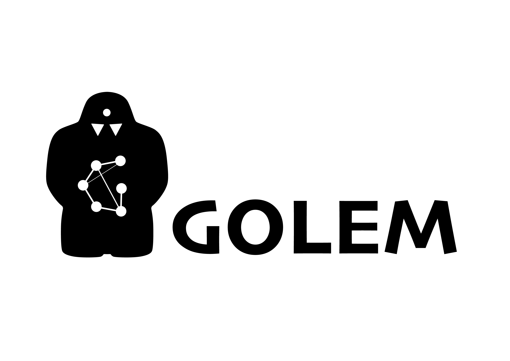

.. class:: center

    |python| |pypi| |build| |docs| |license| |tg|

Graph Optimization and Learning by Evolutionary Methods
-------------------------------------------------------

GOLEM is an open-source AI framework for optimization and learning of structured graph-based models with meta-heuristic methods. It is centered around 2 ideas:

1. Potential of meta-heuristic methods in complex problem spaces.

Focus on meta-heuristics allows approaching kinds of problems where gradient-based learning methods (notably, neural networks) can't be easily applied, like optimization problems with multiple conflicting objectives or having combinatorial character.

2. Importance of structured models in many problem domains.

Graph-based learning enables solutions in the form of structured and hybrid probabilistic models, not to mention that a wide range of domain-specific problems have a natural formulation in the form of graphs.

Together this constitutes an approach to AI that potentially leads to structured, intuitive, interpretable methods and solutions for a wide range of tasks.

Core Features
=============

- **Structured** models with joint optimization of graph structure and properties (node attributes).
- **Metaheuristic** methods (notably, evolutionary) applicable for any task with well-defined objective.
- **Multi-objective** optimization that can take into account both quality and complexity.
- **Constrained** optimization with support for arbitrary domain-specific constraints.
- **Extensible** to new domains.
- **Interpretable** thanks to meta-heuristics, structured models, adn visualisation tools.
- **Reproducible** thanks to rich optimization history and model serialization.

Applications
==================

GOLEM is potentially applicable for any optimization problem structures

- that can be represented as directed graphs;
- with some clearly defined fitness function on them.

Graph models can represent fixed structures (e.g. physical model such as truss structures) or functional models that define a data-flow or inference process (e.g. bayesian networks that can be fitted and queried).

Examples of GOLEM applications:

- Automatic Machine Learning (AutoML) with optimal ML pipelines search in `FEDOT framework <https://github.com/aimclub/FEDOT>`_
- Bayesian network structure search in `BAMT framework <https://github.com//FEDOT>`_
- Differential equation discovery for physical models in `EPDE framework <https://github.com/ITMO-NSS-team/EPDE>`_
- Geometric design of physical objects in `GEFEST framework <https://github.com/aimclub/GEFEST>`_
- `Neural architecture search <https://github.com/ITMO-NSS-team/nas-fedot>`_

As GOLEM is a general-purpose, it's easy to imagine fore potential applications, for example, finite state automata search for robotics control or molecular graph learning for drug discovery, and more.

Installation
============

GOLEM can be installed with ``pip``:

.. code-block::

  $ pip install thegolem

Project Structure
=================

The repository includes the following packages and directories:

- Package `core` contains the main classes and scripts.
- Package `core.adapter` is responsible for transformation between domain graphs and internal graph representation used by optimisers.
- Package `core.dag` contains classes and algorithms for representation and processing of graphs.
- Package `core.optimisers` contains graph optimisers and all related classes (like those representing fitness, individual, population, etc.), including optimization history.
- Package `core.optimisers.genetic` contains genetic (also called evolutionary) graph optimiser and operators (mutation, selection, and so on).
- Package `core.utilities` contains utilities and data structures used by other modules.
- Package `serializers` contains class `Serializer` with required facilities, and is responsible for serialization of project classes (graphs, optimization history, and everything related).
- Package `visualisation` contains classes that allow to visualise optimization history, graphs, and certain plots useful for analysis.
- Package `examples` includes several use-cases where you can start to discover how the framework works.
- All unit and integration tests are contained in the `test` directory.
- The sources of the documentation are in the `docs` directory.

Current R&D and future plans
============================

Any contribution is welcome. Our R&D team is open for cooperation with other scientific teams as well as with industrial partners.

Contribution Guide
==================

- The contribution guide is available in the `repository <https://github.com/nccr-itmo/FEDOT/blob/master/docs/source/contribution.rst>`__.

Acknowledgments
===============

We acknowledge the contributors for their important impact and the participants of the numerous scientific conferences and workshops for their valuable advice and suggestions.

Supported by
============

The project is maintained by the research team of the Natural Systems Simulation Lab. It is a part of the `National Center for Cognitive Research of ITMO University <https://actcognitive.org/>`_, that supports research and development of the project.

Contacts
========
- `Telegram channel for solving problems and answering questions on FEDOT <https://t.me/FEDOT_helpdesk>`_
- `Natural System Simulation Team <https://itmo-nss-team.github.io/>`_
- `Anna Kalyuzhnaya <https://scholar.google.com/citations?user=bjiILqcAAAAJ&hl=ru>`_, Team leader (anna.kalyuzhnaya@itmo.ru)
- `Newsfeed <https://t.me/NSS_group>`_
- `Youtube channel <https://www.youtube.com/channel/UC4K9QWaEUpT_p3R4FeDp5jA>`_

Citation
========

If you use our project in your work or research, we would appreciate citations.

@article{nikitin2021automated,
  title = {Automated evolutionary approach for the design of composite machine learning pipelines},
  author = {Nikolay O. Nikitin and Pavel Vychuzhanin and Mikhail Sarafanov and Iana S. Polonskaia and Ilia Revin and Irina V. Barabanova and Gleb Maximov and Anna V. Kalyuzhnaya and Alexander Boukhanovsky},
  journal = {Future Generation Computer Systems},
  year = {2021},
  issn = {0167-739X},
  doi = {https://doi.org/10.1016/j.future.2021.08.022}}

@inproceedings{polonskaia2021multi,
  title={Multi-Objective Evolutionary Design of Composite Data-Driven Models},
  author={Polonskaia, Iana S. and Nikitin, Nikolay O. and Revin, Ilia and Vychuzhanin, Pavel and Kalyuzhnaya, Anna V.},
  booktitle={2021 IEEE Congress on Evolutionary Computation (CEC)},
  year={2021},
  pages={926-933},
  doi={10.1109/CEC45853.2021.9504773}}

Other papers - in `ResearchGate <https://www.researchgate.net/project/Evolutionary-multi-modal-AutoML-with-FEDOT-framework>`_.

.. |docs| image:: https://readthedocs.org/projects/thegolem/badge/?version=latest
    :target: https://thegolem.readthedocs.io/en/latest/?badge=latest
    :alt: Documentation Status

.. |build| image:: https://github.com/aimclub/GOLEM/actions/workflows/unit-build.yml/badge.svg?branch=main
   :alt: Build Status
   :target: https://github.com/aimclub/GOLEM/actions/workflows/unit-build.yml

.. |coverage| image:: https://codecov.io/gh/aimclub/GOLEM/branch/main/graph/badge.svg
   :alt: Coverage Status
   :target: https://codecov.io/gh/aimclub/GOLEM

.. |pypi| image:: https://img.shields.io/pypi/v/thegolem.svg
   :alt: PyPI Package Version
   :target: https://img.shields.io/pypi/v/thegolem

.. |python| image:: https://img.shields.io/pypi/pyversions/thegolem.svg
   :alt: Supported Python Versions
   :target: https://img.shields.io/pypi/pyversions/thegolem

.. |license| image:: https://img.shields.io/github/license/aimclub/GOLEM
   :alt: Supported Python Versions
   :target: https://github.com/aimclub/GOLEM/blob/main/LICENSE.md

.. |downloads_stats| image:: https://static.pepy.tech/personalized-badge/thegolem?period=total&units=international_system&left_color=grey&right_color=brightgreen&left_text=Downloads
   :target: https://pepy.tech/project/thegolem

.. |tg| image:: https://img.shields.io/badge/Telegram-Group-blue.svg
   :alt: Telegram Chat
   :target: https://t.me/FEDOT_helpdesk

.. |by-golem| image:: http://img.shields.io/badge/powered%20by-GOLEM-orange.svg?style=flat
   :target: http://github.com/aimclub/GOLEM
   :alt: Powered by GOLEM