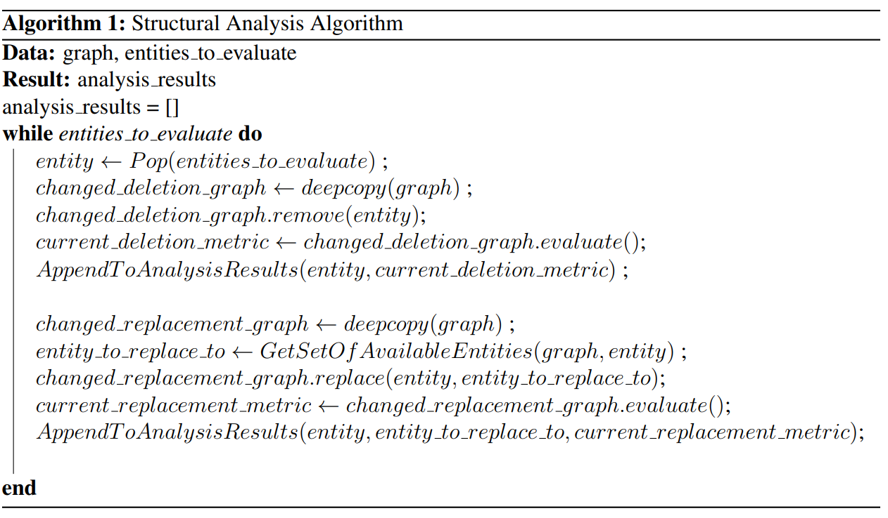
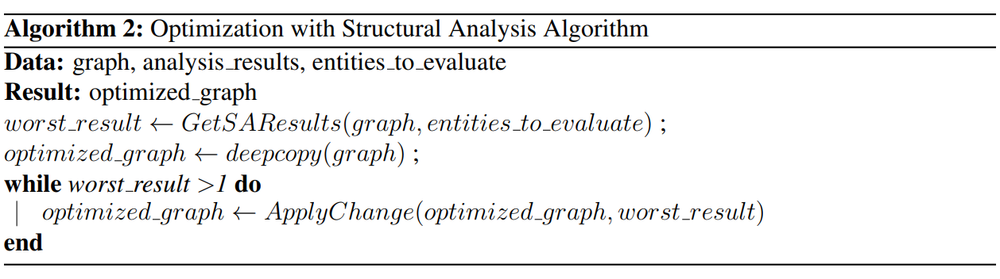

Structural Analysis
===============================

The structural analysis is used to identify the influential parts of a graph
(node or edges) and assess the magnitude of the impact of each part.
It is widely used to make data-driven decisions and to test assumptions
made during the analysis. The simulations are used to test the model's robustness
and identify the threshold values beyond which the outcome will have a positive or
negative impact.

Main concepts
-------------

The main logic of Structural Analysis is pretty simple: the algorithm tries to delete
every part of the graph and therefore evaluates the changed one and compares its metric
with the original one's. If metric with applied change is higher than it was before --
than the change should be applied, otherwise not.

There are two pseudocode samples to illustrate the way SA works.

There are 5 approaches to analysing graph structure: Node Deletion, Node Replacement,
Subtree Deletion, Edge Deletion and Edge Replacement. They can be used all together and
in any combination.

Exploring the code
------------------

Structural Analysis means structure modification like Node deletion, Node Replacement,
Subtree Deletion, Edge Deletion or Edge Replacement.
Within GOLEM, Structural Analysis can be applied on the different levels of graph:

* The most common way to apply SA is to apply it to the whole graph
using `GraphStructuralAnalysis`_. And also this is the only way to actually `optimize` graph --
apply analysis results to it. It can be done with `optimize`_ method and also analysis results
can be obtained by using `analyze`_ method.

.. code-block:: python

    from examples.structural_analysis.opt_graph_optimization import get_opt_graph, custom_metric
    from golem.core.dag.graph_verifier import GraphVerifier
    from golem.core.dag.verification_rules import DEFAULT_DAG_RULES
    from golem.core.optimisers.objective import Objective
    from golem.core.optimisers.opt_node_factory import DefaultOptNodeFactory
    from golem.structural_analysis.graph_sa.graph_structural_analysis import GraphStructuralAnalysis
    from golem.structural_analysis.graph_sa.sa_requirements import StructuralAnalysisRequirements

    if __name__ == "__main__":
        opt_graph = get_opt_graph()
        opt_graph.show()

        objective = Objective({'custom': custom_metric})
        node_factory = DefaultOptNodeFactory()

        opt_graph = get_opt_graph()
        requirements = StructuralAnalysisRequirements(graph_verifier=GraphVerifier(DEFAULT_DAG_RULES),
                                                      main_metric_idx=0,
                                                      seed=1)

        # structural analysis will optimize given graph if at least one of the metrics was increased.
        sa = GraphStructuralAnalysis(objectives=[objective] * 2, node_factory=node_factory,
                                     requirements=requirements)

        optimized_graph = sa.optimize(graph=opt_graph, n_jobs=1, max_iter=5)
        optimized_graph.show()

* SA can also be applied only to nodes or to edges with `NodesAnalysis`_ or
`EdgesAnalysis`_ respectively.

.. code-block:: python

    from examples.structural_analysis.opt_graph_optimization import get_opt_graph, custom_metric
    from golem.core.dag.graph_verifier import GraphVerifier
    from golem.core.dag.verification_rules import DEFAULT_DAG_RULES
    from golem.core.optimisers.objective import Objective
    from golem.core.optimisers.opt_node_factory import DefaultOptNodeFactory
    from golem.structural_analysis.graph_sa.nodes_analysis import NodesAnalysis
    from golem.structural_analysis.graph_sa.sa_requirements import StructuralAnalysisRequirements

    if __name__ == "__main__":
        opt_graph = get_opt_graph()
        opt_graph.show()

        objective = Objective({'custom': custom_metric})
        node_factory = DefaultOptNodeFactory()

        opt_graph = get_opt_graph()
        requirements = StructuralAnalysisRequirements(graph_verifier=GraphVerifier(DEFAULT_DAG_RULES),
                                                      main_metric_idx=0,
                                                      seed=1)

        # structural analysis will optimize given graph if at least one of the metrics was increased.
        sa = NodesAnalysis(objectives=[objective] * 2, node_factory=node_factory,
                           requirements=requirements)

        analysis_result = sa.analyze(graph=opt_graph, n_jobs=1)

* If analysis of only one entity(node or edge) is needed, `NodeAnalysis`_ or
`EdgeAnalysis`_ can be used.

.. code-block:: python

    from examples.structural_analysis.opt_graph_optimization import get_opt_graph, custom_metric
    from golem.core.dag.graph_verifier import GraphVerifier
    from golem.core.dag.verification_rules import DEFAULT_DAG_RULES
    from golem.core.optimisers.objective import Objective
    from golem.core.optimisers.opt_node_factory import DefaultOptNodeFactory
    from golem.structural_analysis.graph_sa.node_sa_approaches import NodeAnalysis
    from golem.structural_analysis.graph_sa.sa_requirements import StructuralAnalysisRequirements

    if __name__ == "__main__":
        opt_graph = get_opt_graph()
        opt_graph.show()

        objective = Objective({'custom': custom_metric})
        node_factory = DefaultOptNodeFactory()

        opt_graph = get_opt_graph()
        requirements = StructuralAnalysisRequirements(graph_verifier=GraphVerifier(DEFAULT_DAG_RULES),
                                                      main_metric_idx=0,
                                                      seed=1)

        # structural analysis will optimize given graph if at least one of the metrics was increased.
        sa = NodeAnalysis(node_factory=node_factory)

        analysis_result = sa.analyze(graph=opt_graph, node=opt_graph.nodes[0], objectives=[objective])

But generally, all of this approaches to graph analysis can be embodied by
`GraphStructuralAnalysis`_.

.. _GraphStructuralAnalysis: https://github.com/aimclub/GOLEM/tree/main/golem/structural_analysis/graph_sa/graph_structural_analysis.py#L24

.. _EdgesAnalysis: https://github.com/aimclub/GOLEM/tree/main/golem/structural_analysis/graph_sa/edges_analysis.py

.. _NodesAnalysis: https://github.com/aimclub/GOLEM/tree/main/golem/structural_analysis/graph_sa/nodes_analysis.py

.. _EdgeAnalysis: https://github.com/aimclub/GOLEM/tree/main/golem/structural_analysis/graph_sa/edge_sa_approaches.py

.. _NodeAnalysis: https://github.com/aimclub/GOLEM/tree/main/golem/structural_analysis/graph_sa/node_sa_approaches.py